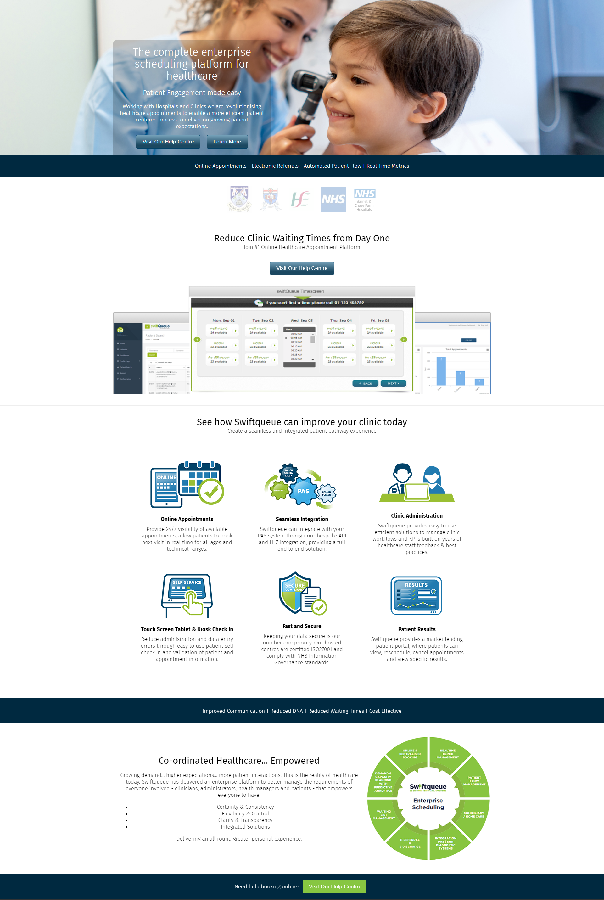
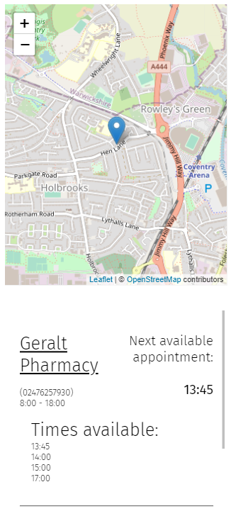
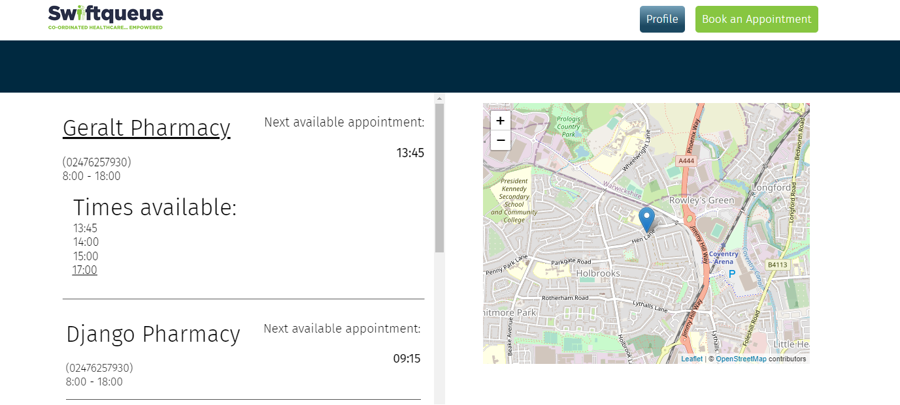

<h1>Swiftqueue</h1>
  

<h3>Apointment booking platform build with <h3>

  

    
    React
  

  

    
    MongoDB
  

  

    
    Sass
  

<h3>Fully Responsive Website</h3>

  
  

<h3>Map</h3>

<h4>Shows your location and local clinics</h4>

Local clinics are random location in area of current user location

  

<h3>Run</h3>

# Frontend (:3000), Backend (:5000)

npm run dev

<h3>Login</h3>

# Sample User Logins

Login as admin

masta@example.com

password: 123

